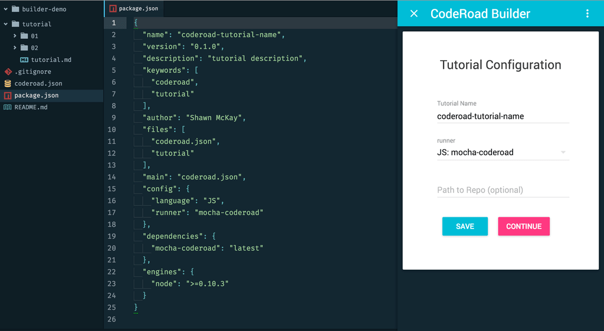

Get setup quickly with CodeRoad: open the **builder-coderoad** plugin in an empty directory & click "start".

{: .doc-image.lazy}

Filling out the first page should create:

* an example **tutorial.md**, which imports several tutorial files
* an example **test** directory with a few example tests
* a **package.json** configuration with some of the following settings:

```json
{
  "name": "coderoad-$TUTORIAL-NAME$",
  "version": "0.1.0",
  "main": "coderoad.json",
  "keywords": [
    "coderoad",
    "tutorial"
  ],
  "coderoad": {
      "dir": "tutorial",
      "testSuffix": ".spec.js",
      "runner": "mocha-coderoad"
  }
}
```
