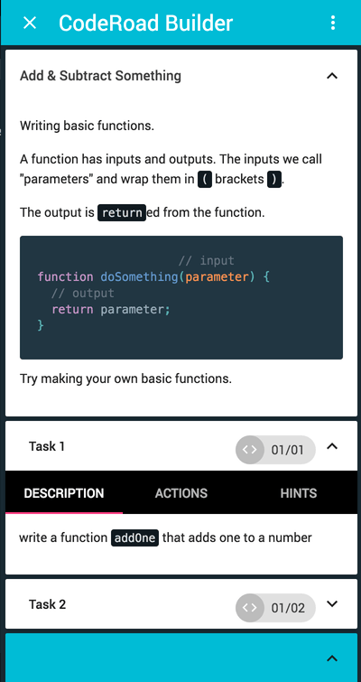

{: .image.lazy.right}

The project view can be seen from the "edit" page.

Changes will update whenever you **save** a file from the text editor.

Clicking on items in the view will move your cursor to the corresponding code in the text editor.

From the "edit" page, you can also view your tasks. Tasks are composed of:

##### description
A summary of the task objective.

##### actions

Trigged changes in the users text editor, such as "open" a file or "insert" text. See the [coderoad-API docs](/tutorial-docs.html#coderoad-API) for more.

##### Hints

Helpful tips for the user.

##### Tests

Unit tests that verify task success and provide helpful failure messages. Learn more in the [test docs](/tutorial-docs.html#tests). These are marked by the file path, in the side example: `<> 01/01`. Clicking on tests will route to the test page.

##### onPageComplete

A message that will display when all page tasks are complete. It is located in the blue box at the bottom.
