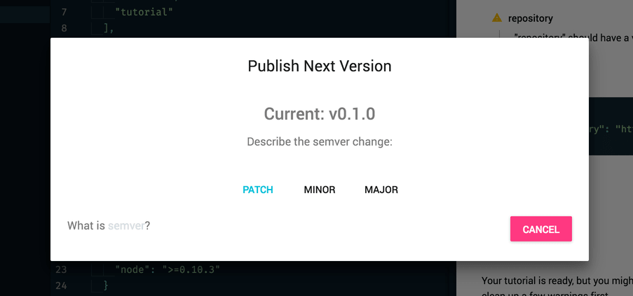

After validation, tutorials can be published to NPM.

{: .doc-image.lazy}

Select the type of version release:

| Release | Change         | Description       |
|---------|----------------|-------------------|
| patch   | 0.1.0 -> 0.1.1 | a fix             |
| minor   | 0.1.0 -> 0.2.0 | a new feature     |
| major   | 0.1.0 -> 1.0.0 | a breaking change |

> Publishing from "builder-coderoad" is not currently enabled. See the [publish docs](/tutorial-docs#publish) for how to do this from the command-line.
